## Experiment with Attention Mechanisms

Experiment 1 :
*This experiment uses Transformers with attention
| Attentions | Training Loss | Traning PPL | Validation Loss | Validation PPL |
|----------|----------|----------|----------|----------|
|*General Attention    | 4.040     | 56.836     | 4.227     | 68.485     |
| *Multiplicative Attention   | 3.384     | 29.486     | 4.022     | 55.794     |
| *Additive Attention  | 2.839    |   17.096   | 3.759    | 42.894     |
| *Multi-head Attention  | 3.648    | 38.399     |  4.001   | 54.654    |

Experiment 2 : 
**This experiment uses rnn with attention
| Attentions | Training Loss | Traning PPL | Validation Loss | Validation PPL |
|----------|----------|----------|----------|----------|
|**General Attention    | 3.306     | 27.270     | 3.947     | 51.755     |
| **Multiplicative Attention   | 3.710     | 40.863     | 3.937     | 51.271     |
| **Additive Attention  | 2.570     | 13.064     | 3.904     | 49.624     |

Note: These parameters are related to the lowest Validation loss during the traning.
## Evaluation and Verification

Evaluation on experiment 1 :
*This experiment uses Transformers with attention
| *General Attention | *Multiplicative Attention | *Additive Attention |*Multi-head Attention |
|------------------------|------------------------|------------------------|------------------------|
|BLEU socre: 2.94  |BLEU socre: 10.85  |BLEU socre: 23.64 |BLEU socre: 8.63| 
|TEST PPL: 68.563 |TEST PPL: 55.948 |TEST PPL:43.586 |TEST PPL: 54.968|
| 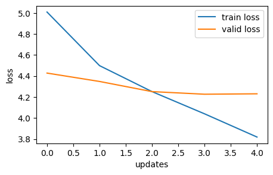 |  | 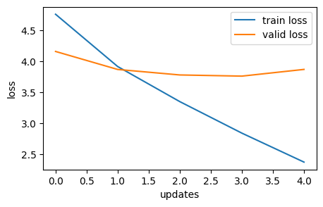 |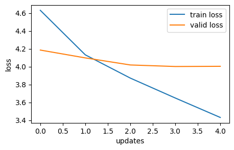|
| 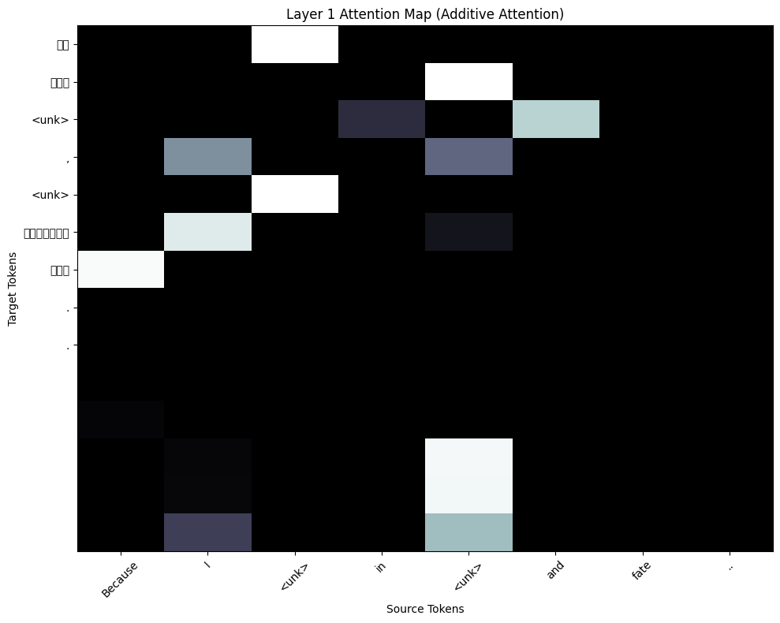 | 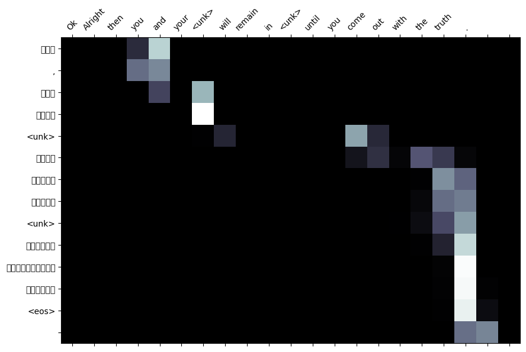 | 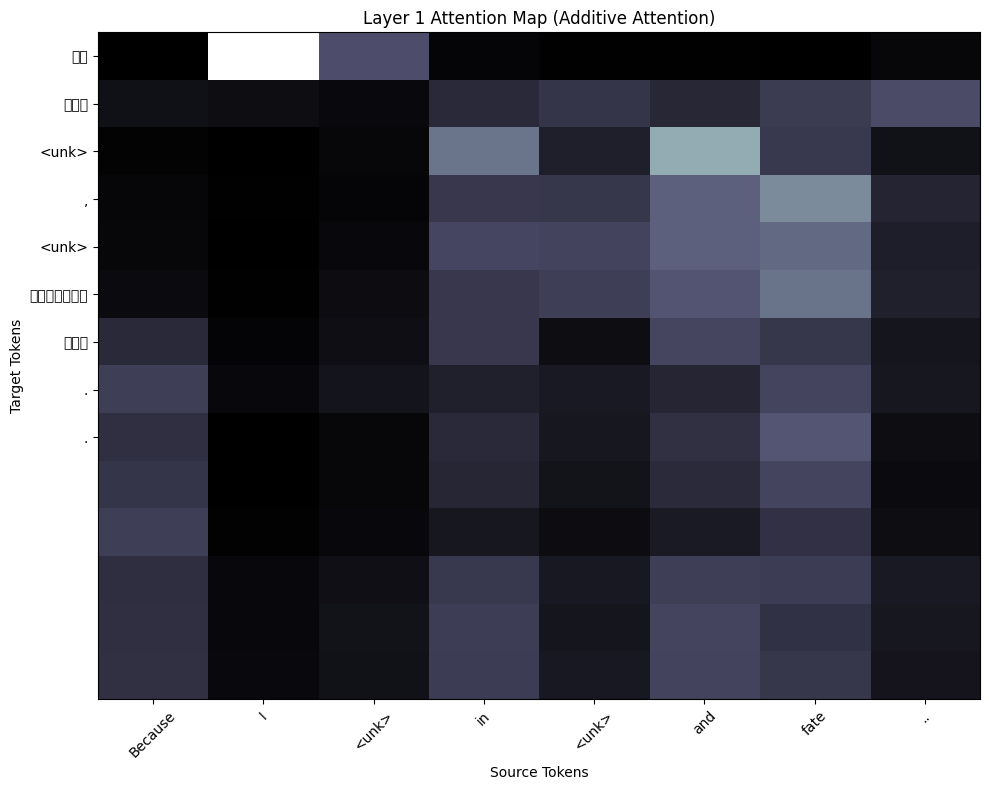 |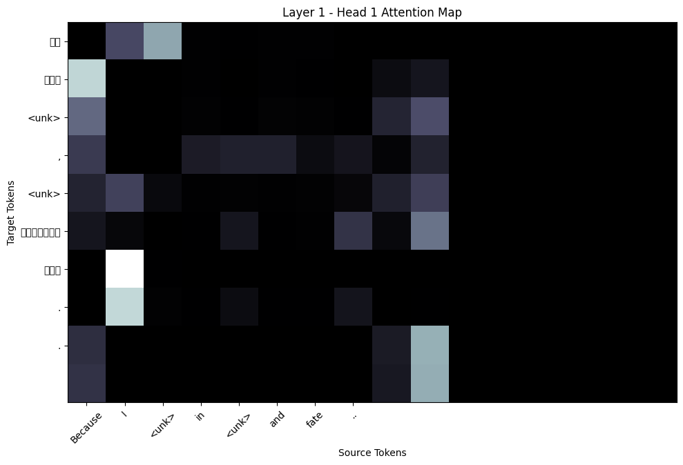 |

Evaluation on experiment 2 :
**This experiment uses rnn/ GRU with attention
| **General Attention | **Multiplicative Attention | **Additive Attention |
|------------------------|------------------------|------------------------|
|BLEU socre: 4.99 |BLEU socre: 4.03 |BLEU socre: 3.13|
|TEST PPL: 50.646 |TEST PPL: 50.770 |TEST PPL: 47.084|
| 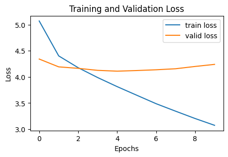 | 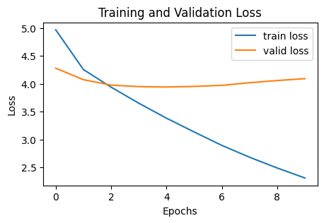 | 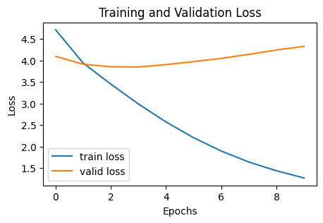 |
| 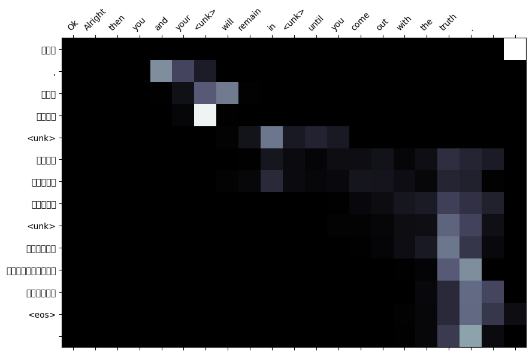 |  | 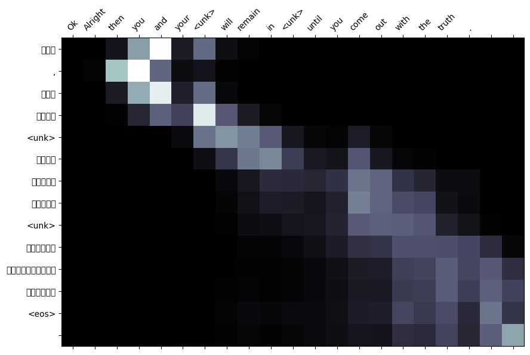 |

## Analysis and Discussion

Analysis on experiment 1 :
*This discussion uses transformers with attention

Based on the experiment results, Additive Attention is the most effective attention mechanism for translating between Sinhala and English, achieving the highest BLEU score and lowest perplexity. Multiplicative Attention and Multi-head Attention perform moderately well, while General Attention is not suitable for this task.

-------------------------------------------------------------------------------------------------------------------------------------------------------------------------
Analysis on experiment 2 :
**This discussion uses rnn with attention

Based on the experiment results, General Attention performs best in translation quality (BLEU), likely due to its ability to capture contextual relationships. But, it has higher perplexity, suggesting weaker probabilistic calibration.

Additive Attention good in training efficiency and generalization (lowest losses/PPL) but underperforms in BLEU, possibly due to overfitting.

Selecting Best model for machine translation:

Prioritize BLEU -> General Attention.

Prioritize training speed and perplexity -> Additive Attention.

General Attention is more effective for translation tasks, while Additive Attention is better for efficient training and sequence prediction.Thus, select Genaral attention for the Machine Translation in the case of rnn based attention.

## Results: Dash Application (Additive Attention with Transformers)

## Documentation: Dash Application Interface with Language Model for Machine Translation
This documentation explains how the Dash application interfaces with the language model for translating English text to Sinhala. 
The application uses a sequence-to-sequence (Seq2Seq) transformer model with Additive Attention for translation.

1. Overview
The Dash application provides a user interface for translating English text into Sinhala. It interfaces with a pre-trained transformer model to perform the translation. The key components of the application are:
Dash Framework: For building the web interface.
PyTorch: For loading and running the transformer model.
Transformer Model: A Seq2Seq model with Additive Attention, trained for English-to-Sinhala translation.

2. Key Components
Model and Vocabulary Loading
Model: The pre-trained transformer model is loaded from best-model-additive-attentionTransformer.pt.
Vocabularies:
vocabAA_en.pt: English vocabulary.
vocabAA_si.pt: Sinhala vocabulary.
Device Configuration: The model runs on the GPU if available; otherwise, it defaults to the CPU.
Translation Function
The translate_sentence function performs the translation:
Input Preprocessing:
The input English sentence is tokenized and converted into a tensor using the source vocabulary.
Model Inference:
The model generates the translation token by token, starting with the <sos> (start-of-sequence) token.
The loop continues until the <eos> (end-of-sequence) token is generated or the maximum sequence length is reached.
Output Postprocessing:
The predicted token indices are converted back into Sinhala words using the target vocabulary.
Dash Interface
Input: A text area where users can enter English text.
Output: A div that displays the translated Sinhala text.
Callback:
When the "Translate" button is clicked, the input text is passed to the translate_sentence function.
The translated text is displayed in the output div.

3. Workflow
User Input:
The user enters English text in the input text area and clicks the "Translate" button.
Translation Process:
The input text is tokenized and converted into a tensor using the source vocabulary.
The tensor is passed to the transformer model, which generates the translation token by token.
The translation stops when the <eos> token is generated or the maximum sequence length is reached.

